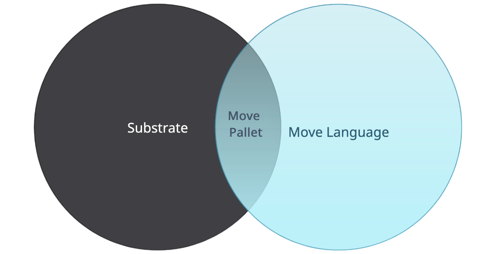

# Move Pallet

A pallet for substrate based blockchains to enable the usage of smart contracts written in the Move-language.



## Overview

Smart contracts can directly be implemented and executed as Move scripts or modularized in Move modules. Therefor, the pallet supports publishing of Move modules and the execution of Move scripts to achieve this functionality. In the case of larger projects, the pallet provides the publishing of a bundle (multiple Move modules).

For the execution of Move scripts and the publication of Move modules, the Move source code has to be compiled and serialized into bytecode. For this purpose, the tool [`smove`][smove] is provided. The tool also provides further helpful features for developing and working with the Move language and this pallet.

### Requirements

- [Substrate developer environment][substrate-dev-env]
- [smove] is a package manager for Move language in Substrate. Follow the instructions in its repo to install it.
- [cargo]
- Docker (not mandatory)


## Move Example

A basic sample of the Move module and the Move script is shown below.

```move
module DeveloperBob::CarWash {
    /// Buys `count` washing coin(s) for the car wash. Therfor, `COIN_PRICE`*`count` will be withdrawn from the user's account.
    public fun buy_coin(user: &signer, count: u8) acquires Balance {
        // ...
    }
}
```

More details about the module above in our [tutorial]. For this example, the module got published and the following script only needs to be executed.

```move
script {
    use DeveloperBob::CarWash;

    fun buy_coin(account: signer, count: u8) {
        CarWash::buy_coin(&account, count);
    }
}
```

For a general overview and further details of the Move language, have a look at the [Move Book][move-book].


## Tutorial

To dive quickly into the topic, explore our [simple tutorial][tutorial].


## Tech Guide

There is a [tech-guide] available, where you can find advanced topics like pallet configuration, Docker, and benchmarking.

Read the [design document][design-document] to learn more about the pallet API and how it works.

### Template Node

Use [these instructions][quickstart-temp-node] to setup the template-node with Move pallet integrated.

### Testing

Verify that everything works fine by running the pallet's unit tests with all features enabled:
```sh
cargo test --verbose --features build-move-projects-for-test
```

You can find further details about testing possibilities in the [tech-guide].


## Important Note

_The MoveVM pallet is a good starting point for potential parachains that want to support Move._
_There are more potential improvements to be made._
_Still, those are yet to be defined and properly implemented within a future parachain project - since it's hard to predict what exactly the parachain might need or not need._
_The current solution is general and parachain-agnostic._
_The MoveVM is taken from the Move language repository - any possible safety issues are inherited from that repo._
_Therefore, the Substrate MoveVM fork ([substrate-move]) should get all upstream changes from that repository._
_The first parachain adapters should do additional testing to ensure the robustness of the solution._


## See also

- [move-stdlib] - Provides elementary Move functions in Move smart contracts. 
- [substrate-move] - A modified MoveVM fork for the use of MoveVM in the pallet-move repo.
- [smove] - Handles the gas estimation, the serialization of script and module transactions, and the inspection of the module's ABIs.
- [substrate-stdlib]- Provides elementary Substrate functions in Move smart contracts.

## License

[MIT](LICENSE) License.

<p align="center"></p>

## About [Eiger](https://www.eiger.co)

We are engineers. We contribute to various ecosystems by building low level implementations and core components. We believe in Move and in Polkadot and wanted to bring them together. Read more about this project on [our blog](https://www.eiger.co/blog/eiger-brings-move-to-polkadot).

Contact us at hello@eiger.co
Follow us on [X/Twitter](https://x.com/eiger_co)


[cargo]: https://doc.rust-lang.org/cargo/getting-started/installation.html
[design-document]: doc/final-design.md
[move-book]: https://move-language.github.io/move/introduction.html
[move-stdlib]: https://github.com/eigerco/move-stdlib
[quickstart-temp-node]: doc/tech_guide.md#quickstart-guide-for-the-template-node
[smove]: https://github.com/eigerco/smove
[substrate-dev-env]: https://docs.substrate.io/install/
[substrate-move]: https://github.com/eigerco/substrate-move
[substrate-stdlib]: https://github.com/eigerco/substrate-stdlib
[tech-guide]: doc/tech_guide.md#testing
[tutorial]: doc/tutorial.md
