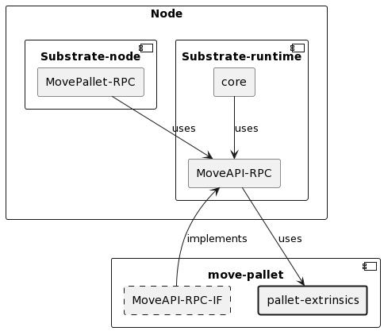
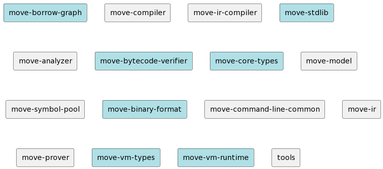
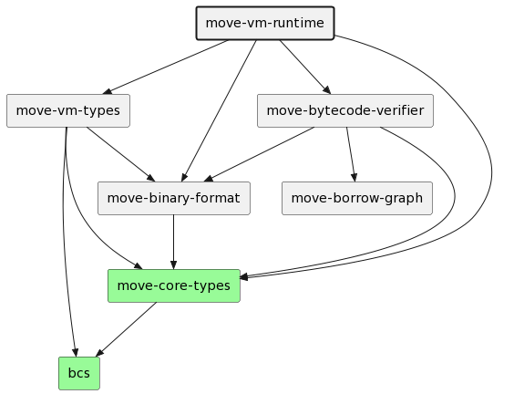
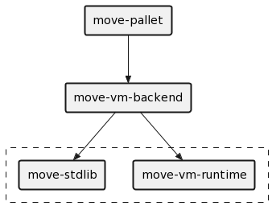
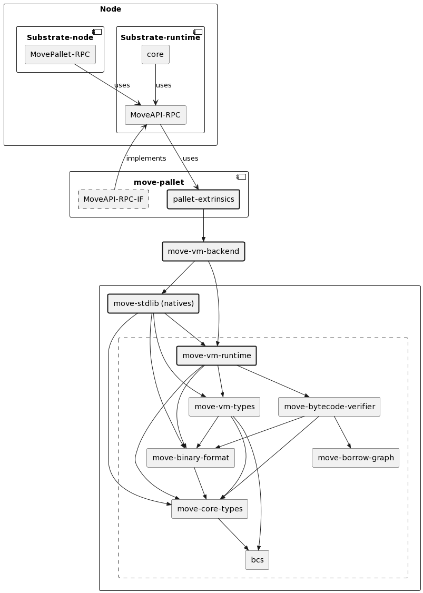

- [Introduction](#introduction)
  - [Move language](#move-language)
  - [Substrate framework](#substrate-framework)
- [The present state of Move VMs](#the-present-state-of-move-vms)
  - [Available forks](#available-forks)
- [Pontem Move fork](#pontem-move-fork)
  - [Necessary adaptations](#necessary-adaptations)
    - [Making all MoveVM crates `no_std`](#making-all-movevm-crates-no_std)
    - [Making all MoveVM crates build for the `wasm32-unknown-unknown` target](#making-all-movevm-crates-build-for-the-wasm32-unknown-unknown-target)
    - [Changing address length from 20 to 32 bytes](#changing-address-length-from-20-to-32-bytes)
  - [Pontem MoveVM pallet](#pontem-movevm-pallet)
- [The way forward](#the-way-forward)
  - [Is forking needed?](#is-forking-needed)
  - [Forking challenges - VM and the toolchain](#forking-challenges-vm-and-the-toolchain)
  - [The proposed architecture solution](#the-proposed-architecture-solution)
    - [Substrate MoveVM pallet](#substrate-movevm-pallet)
    - [MoveVM module and changes](#movevm-module-and-changes)
  - [Testing](#testing)
  - [Repository structure](#repository-structure)
- [Conclusions](#conclusions)

# Introduction
This article describes the ability to incorporate Move Virtual Machine into Substrate-based chains as a runtime module. It also describes the current state of the Move VM (with available forks, including Pontem work) and the team's challenges in making it work with Substrate.

## Move language
Move is a programming language originally developed at Facebook to power the Diem blockchain. Its main aim was to give the ability to write smart contracts that can be run on the specialized virtual machine (Move VM) inside the blockchain. 

Move is a statically-typed language with a syntax that is similar to Rust. It introduces a slightly different resource handling concept where resources can never be copied or implicitly discarded - they can be moved (as the language name states) between program storage locations.

Programs (smart contracts) written in Move language are deployed as a bytecode and executed by the Move VM, which is a stack-based virtual machine. It has been designed to be simple, efficient and platform-agnostic, which means it's possible to integrate with custom blockchains or even run it separately and interact using a command line interface.

Move has been used as the smart-contract language for many blockchains like Sui, Starcoin, Aptos or Diem.

More information about the Move language can be found:
* [Move language whitepaper](https://diem-developers-components.netlify.app/papers/diem-move-a-language-with-programmable-resources/2020-05-26.pdf)
* [Move official repository](https://github.com/move-language/move)
* [The Move book](https://move-language.github.io/move/)
* [Move examples and papers](https://github.com/MystenLabs/awesome-move)

## Substrate framework
[Substrate][Substrate] is a framework (SDK) which provides building tools for custom blockchains. Its main goal is to provide an environment that allows building blockchains with your own logic and features without the need to write everything from scratch. It's written in Rust and provides extensive documentation and usage samples.

Substrate is a modular framework which means it's possible to use only parts of it that are needed for the project. It provides a set of ready-to-use modules that can be used to build a blockchain. Substrate node consists of two general parts:
- a core client with node services (peer discovery, managing transaction requests, responding to RPC calls),
- a runtime which contains all the business logic of the blockchain.

The runtime is responsible for determining the state of the blockchain and processing all requested changes, including validation. The runtime module is designed to compile to WebAssembly and allows it to be extended by modules called pallets developed for the FRAME (Framework for Runtime Aggregation of Modularized Entities) subsystem. Since Move Virtual Machine updates a blockchain state, it should be part of the Substrate's runtime execution. Therefore, it should be provided as a pallet that can be loaded as a module.

[Substrate]: https://substrate.io/

# The present state of Move VMs

The official repository for the Move language is in the [move-language](https://github.com/move-language/move/tree/main/language) repo ([move-vm](https://github.com/move-language/move/tree/main/language/move-vm)). The open-source community maintains it, and other Move forks keep it current.

## Available forks

The most important move-lang forks are:

 - [Aptos](https://github.com/aptos-labs/aptos-core/tree/main/third_party/move) ([move-vm](https://github.com/aptos-labs/aptos-core/tree/main/third_party/move/move-vm))
 - [Starcoin](https://github.com/starcoinorg/starcoin/tree/master/vm) ([move-vm](https://github.com/starcoinorg/starcoin/tree/master/vm/vm-runtime))
 - [0L](https://github.com/0LNetworkCommunity/libra/tree/v6/diem-move) ([move-vm](https://github.com/0LNetworkCommunity/libra/tree/v6/diem-move/diem-vm))
 - [Sui](https://github.com/MystenLabs/sui/tree/main/external-crates/move) ([move-vm](https://github.com/MystenLabs/sui/tree/main/external-crates/move/move-vm))

The most interesting of the above is Sui's fork, a unique dialect of the Move language called Sui Move. The key differences with the Diem-style Move language are:
- Sui uses its own object-centric global storage
- Addresses represent Object IDs
- Sui objects have globally unique IDs
- Sui has module initializers (init)
- Sui entry points take object references as input

The main constraint of Sui Move is that it is tightly coupled with the Sui blockchain - it's less flexible and not so platform agnostic, so it is currently not a candidate fork to be ported to a Substrate pallet.

# Pontem Move fork

The Pontem Network has [adapted the Move language][0] to work with the Substrate framework. In order to do this, some adjustments were made to Move's Virtual Machine (MoveVM). This document provides an overview of all the necessary changes.

[0]: https://github.com/pontem-network/sp-move-vm

## Necessary adaptations
Substrate uses a WebAssembly (Wasm) environment, and this is key to understanding why changes to MoveVM were necessary.

### Making all MoveVM crates `no_std`

The first group of commits that were added by Pontem after forking the original Move
repository deal with making all MoveVM crates [`no_std`][1]. `no_std` means that the crate
does not depend on the Rust standard library. This is important because the Rust standard library may not be available in the Wasm environment. Any crate that depends on the Rust standard library cannot be used in a Substrate pallet.

Apart from adding the crate-level `no_std` attribute, the following changes were made to the code:
* substituted the use of `std` with [`sp-std`][2] crate. `sp-std` is a Substrate crate that provides a subset of the Rust standard library that is compatible with the Substrate runtime.
* removed incompatible code

[1]: https://docs.rust-embedded.org/book/intro/no-std.html
[2]: https://crates.io/crates/sp-std

### Making all MoveVM crates build for the `wasm32-unknown-unknown` target

Apart from setting the build target, this should also be included in all CI/CD configuration updates.

### Changing address length from 20 to 32 bytes

Move address length had to be changed from 20 to 32 bytes to match the [Substrate address length][3]. This was done by changing the `LENGTH` constant in the `move-core-types` crate and updating some hard-coded addresses. In our fork, there won't be a need to make any code changes because the move-lang codebase introduced support for the `address32` feature, which is today used by Aptos and Sui blockchains.

[3]: https://docs.substrate.io/reference/address-formats/

## Pontem MoveVM pallet

The [Pontem MoveVM pallet][4] has a form of a Cargo crate. It depends on the Pontem's MoveVM fork described in the previous section and wraps it into a Substrate pallet using the `frame-support` crate.

The crate exposes 3 main entry points: [`execute`][5], [`publish_module`][6], and [`publish_package`][7]. Each of them expects bytecode and `gas_limit` arguments.

[4]: https://github.com/pontem-network/pontem/tree/master/pallets/sp-mvm.
[5]: https://github.com/pontem-network/pontem/blob/master/pallets/sp-mvm/src/lib.rs#L188
[6]: https://github.com/pontem-network/pontem/blob/master/pallets/sp-mvm/src/lib.rs#L220
[7]: https://github.com/pontem-network/pontem/blob/master/pallets/sp-mvm/src/lib.rs#L252

There are two additional crates inside the pallet crate:
- `rpc` crate - defines the runtime RPC made available by this pallet;
- `runtime` crate - declares the `MVMApiRuntime` trait for runtime-pallet communication.

# The way forward
In this chapter, we outline the strategic plan, decisions and roadmap for the future development and growth of the MoveVM pallet software.

## Is forking needed?

In order to make MoveVM compatible with the Substrate framework, forking of the Move language is necessary.
- Since all runtime pallets in Substrate must be Wasm-compatible, the MoveVM requires a few adaptations to ensure interoperability in `no-std` environments. That implies that all dependencies should be replaced with `no-std` alternatives, or in the worst case, adapted to `no-std` - in that case, more repositories will be forked (one example is the [`bcs`][bcs] crate which is an independent crate in a separate GitHub repository).
- Substrate uses 32-byte addresses, so the `address32` feature must be used in TOML files within our build infrastructure.

## Forking challenges - VM and the toolchain
As the forking is still needed, some challenges need to be addressed for the VM itself and the toolchain.

One of the biggest challenges is to keep the possibility to use already existing contracts written in Move language. Two main goals can be achieved:
- level 1: source compatibility - keep the possibility to use existing contracts written in Move language after recompiling by modified toolchain; 
- level 2: bytecode compatibility - keep the possibility to use existing contracts in bytecode form.

Level 1 compatibility will be achieved, but at this point, we cannot guarantee level 2 compatibility. Level 2 depends on many external factors, like concrete blockchain features (address length, gas metering, etc.).

The Move language directory from the official repo consists of four main parts:
- virtual machine (VM) — contains the bytecode format, a bytecode interpreter, infrastructure for executing a block of transactions and the infrastructure to generate the genesis block.
- bytecode verifier — contains a static analysis tool for rejecting invalid Move bytecode. The virtual machine runs the bytecode verifier on any new Move code it encounters before executing it. The compiler runs the bytecode verifier on its output and surfaces the errors to the programmer.
- move-compiler — contains the Move source language compiler.
- standard library — contains the standard library transaction scripts.

The virtual machine and the bytecode verifier must be fully `no-std` compatible, while the standard library will be partly `no-std` compatible. The move-compiler will generate Move bytecode and ABIs which can be processed by `no-std` built MoveVM binary inside a Substrate pallet. The main challenge here is ensuring all `no-std` changes done to shared libraries do not break interoperability between compiler-generated bytecode and a modified version of MoveVM.

Another critical challenge is keeping the repository in sync with the upstream and separating custom work from the main line, allowing us to perform upgrades efficiently. We aim to provide the least possible changes to the original codebase to provide a better upgrade experience and the ability to follow the mainline with all the language and feature updates. Of course, keeping everything separated from the main repository will not be possible. Therefore, some changes will be applied to the virtual machine itself.

The key point is to perform such minor updates periodically when it would be easier to maintain the changing codebase. Waiting too long between syncs can cause a lot of problems and make it impossible to merge changes without a lot of manual work, which can lead to a situation where it will be easier to fork the repository again and start from scratch, especially if it is done by a separate team than the one who created the fork. 

## The proposed architecture solution
The Move pallet will be implemented according to the Substrate framework standards. It shall integrate a modified version of the MoveVM taken out from the official Move language repo. To integrate MoveVM effectively in the pallet, an additional layer of abstraction will be used.

### Substrate MoveVM pallet
The software design proposed by Pontem's initial work pursues the Substrate pallet architecture and standards. Therefore, we've followed a similar approach to comply with the standard.

Let's dive into the crucial aspects of pallet architecture:
1) Module: The MoveVM pallet represents a module within a Substrate runtime. The MoveVM pallet would include only things needed for interaction with the virtual machine.
2) State: The MoveVM will define its state, which is the data they need to keep track of. That state consists of various variables containing information relevant to the pallet's functionalities. It is stored on the blockchain and updated through transactions and blocks.
3) Storage: It defines the data structures and how they are accessed and modified. The MoveVM pallet would use it to store data in the map of key-value pairs and provide a storage adapter for the Move Virtual Machine storage.
4) Dispatchable Functions - extrinsics: The MoveVM pallet will expose dispatchable functions, which users can call via transactions. Currently, there are three extrinsics defined:
- 'execute' - executes a Move script;
- 'publishModule' - publishes a Move module;
- 'publishPackage' - publishes a Move package.
5) Events: Events inform about changes within the pallet. The MoveVM pallet defines separate events for completing each extrinsic call. Somebody can subscribe to them, allowing external applications to react to specific changes or triggers within the blockchain.
6) Configuration: The MoveVM pallet is configured during the runtime's setup to customize its behaviour. Configuration is done in a standard way, like for any other sample pallets.
7) Traits: The MoveVM pallet defines a set of traits which can be used further in the runtime or RPC node.
8) RPC: The MoveVM pallet incorporates a sub-crate with RPC calls (`pallet-move-rpc` using `jsonrpsee`) that can be used to interact with the pallet from external applications:
- `mvm_estimateGasExecute`,
- `mvm_estimateGasPublish`,
- `mvm_gasToWeight`,
- `mvm_getModule`,
- `mvm_getModuleABI`,
- `mvm_getResource`,
- `mvm_weightToGas`.

The MoveVM pallet divides into three main components - the MoveVM pallet itself, runtime API (fulfilling the pallet's traits), and RPC. The MoveVM pallet is the core, containing all the logic needed to interact with the virtual machine. The runtime API is a separate crate that implements the pallet's traits and exposes them to the runtime. The RPC is a separate crate that implements the pallet's RPC calls and exposes them to the RPC node.

The main part of the pallet is also responsible for storing the Move modules and packages on the chain. It is also responsible for the gas metering and gas conversion. Move language (like many other smart contract languages) has a concept of `gas` for executing contracts, whereas Substrate uses `Weights`. Those values need to be transformed before usage as well as there is a need to provide the user with API to estimate the possible gas cost for executing particular Move scripts or publishing data.

The pallet will use the MoveVM back-end (within the crate called move-vm-backend) to communicate directly with the Move Virtual Machine. This back-end layer allows us to easily use another VM implementation in the future. The VM back-end will create MoveVM inside the runtime and execute the scripts. It will also be able to handle any error and translate it to a form acceptable and understandable by the Substrate framework.

### MoveVM module and changes

A list of all Move crates can be seen in the image below. The impacted crates are shown in blue color.

The main component of MoveVM is the `move-vm-runtime` crate - it's a core part of the virtual machine and needs to be adapted for `no-std` environments such as Wasm-based Substrate pallets. The crate depends on a few other Move language crates, which consequently also require adaptations to `no-std`. The image below shows a dependency tree for the `move-vm-runtime` crate.

To estimate how much work it takes to adapt certain Move crates to `no-std` and make them Substrate compatible, our team decided to adapt two crates from the above image (marked in green). The results are promising - it shouldn't take more than a few days per Move crate. All Move crates from the above are part of the core language repo except for the `bcs` crate, which is contained separately in the [diem/bcs][bcs] repository. This repo will be forked in order to make `no-std` adaptations.

One more crate that also requires partial `no-std` adaption is the `move-stdlib` crate. Only the `natives` part of crate requires modifications.

All these crates that require adaptions will still be compiled with full std support when used by the move-compiler. For that reason, all `no-std` changes will be accessible through the `feature` mechanism provided by the Rust toolchain.

[bcs]: https://github.com/diem/bcs

The MoveVM-backend module `move-vm-backend` will be used as an interface between `move-pallet` Substrate pallet and MoveVM. It will take care of the initial configuration of the MoveVM, genesis configuration, storage setup, gas cost tables, etc.

A full architecture can be seen in the image below.

## Testing
Software testing is an essential process in the software development life cycle that helps identify software application bugs, defects, and errors. We are designing and implementing tests from the start of the project, and each design decision considers the code's testability. The team plans tests on different levels, from unit to integration and end-to-end tests. You can find more in the [Testing Guide](testing_guide.md) document, one of the project deliverables.

It's worth mentioning the unit and integration test architecture that demands doing additional work to provide a test runtime environment. There is a need to create a runtime mock to run tests in the CI/CD pipeline. The mock should be able to run the tests like the actual runtime but without running the whole blockchain node. The pallet will include a mock file that provides a runtime environment using the `construct_runtime!` macro with a test configuration like the other pallets. Moreover, we will add testing assets (like Move modules) to be able to perform each test with the same data. Extracting those modules as external assets will allow us to reuse them in other tests and projects.

Similarly, we'll mock the runtime for benchmarking purposes.

## Repository structure
In order to keep things separated and easy to maintain, we propose to create a separate repository for each forked codebase and a separate repository for the VM pallet itself.

The package and repository structure will look like this:
- `pallet-move` - the [MoveVM pallet repository](https://github.com/eigerco/pallet-move) - contains the pallet codebase, tests, and documentation. Work is done in the `main` branch.
- `pallet-move-rpc` - the RPC MoveVM pallet repository - placed under `src/rpc` directory in the `pallet-move` repository. It contains the RPC codebase, tests, and documentation. Work is done in the `main` branch.
- `pallet-move-runtime-api` - the runtime API MoveVM pallet repository - placed under `src/rpc/runtime-api` directory in the `pallet-move` repository. Work is done in the `main` branch.
- `substrate-move` - Move language fork [repository](https://github.com/eigerco/substrate-move) - contains the Move language codebase, tests, and documentation.
- `substrate-node-template-move-vm-test` - testing [node repository](https://github.com/eigerco/substrate-node-template-move-vm-test) - contains the node codebase, tests, and documentation. Work is done in the `pallet-move` branch.
- [`bcs`][bcs] - Rust implementation of the Binary Canonical Serialization (BCS) format.

Testing code should be separated from the actual codebase. That's a slightly different approach compared to the previous Pontem work, where the Move pallet and machine were placed inside the main Pontem repository and built together with the node. Pontem implemented a real node and a usable blockchain, and therefore, it was justified to keep everything in one place. In our case, we will not build a complete blockchain but only a MoveVM pallet. We will use only a modified template node to prove our solution works correctly. It will be easier for further pallet integrators to separate it from the node codebase as they can only fork the pallet repository and integrate it with their solutions.

# Conclusions
In conclusion, the successful completion of this software project holds great promise for the Move community and the broader blockchain community. Developing a Substrate pallet that enables the integration of the Move language within the Substrate blockchain represents a significant step forward in enhancing the versatility and functionality of blockchain applications.

One of the crucial goals of this project is achieving interoperability with existing Move contract sources and minimising changes introduced to the Move Virtual Machine. We recognize the significance of seamless integration with existing Substrate and Move functionalities and other modules. By prioritizing interoperability, we aim to enhance the overall ecosystem, enabling developers to build innovative applications and smart contracts more efficiently.

In conclusion, our team is determined to overcome challenges and deliver a Substrate pallet that empowers users with the capabilities of the Move language. By focusing on project management, adhering to timelines, and prioritizing interoperability, our efforts will contribute to the growth and success of the Substrate blockchain ecosystem. Together with the community, we look forward to the realization of this exciting project and its potential impact on the broader blockchain space.
