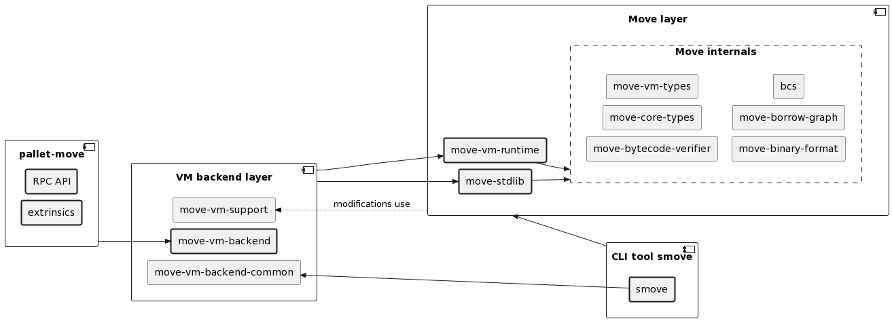

# Introduction
This article discusses the pallet-move functionality.

- [Pallet API](#pallet-api)
  - [Extrinsics](#extrinsics)
  - [RPC](#rpc)
- [Design architecture](#design-architecture)


# Pallet API
[smove] tool is used to build modules and bundles and to create script transactions (with given script arguments). The output from the `smove` tool in the Move projects is the main input for the below extrinsics.

MoveVM scripts and modules are not allowed to run forever - therefore, the `gas` value is used for that purpose. The provided `gas` gets converted to `Weight`, a mechanism that prevents extriniscs from running forever.
The script execution is an atomic operation - if the provided gas is insufficient, the MoveVM within the pallet will reject the script, and no changes shall occur - but the user will pay for the used weight anyway. So, using the gas estimation RPC method is well recommended.

Scripts and modules have limited access to the balance transfer functionality via the `cheque_amount` parameter - the maximum amount of balance the account scripts can transfer from the signer of the extrinsic.

## Extrinsics

```rust
    /// Execute Move script transaction sent by the user.
    #[pallet::call_index(0)]
    #[pallet::weight(T::WeightInfo::execute())]
    pub fn execute(
        origin: OriginFor<T>,
        transaction_bc: Vec<u8>,
        gas_limit: u64,
        cheque_limit: BalanceOf<T>,
    ) -> DispatchResultWithPostInfo;
```

```rust
    /// Publish a Move module sent by the user.
    /// Module is published under its sender's address.
    #[pallet::call_index(1)]
    #[pallet::weight(T::WeightInfo::publish_module())]
    pub fn publish_module(
        origin: OriginFor<T>,
        bytecode: Vec<u8>,
        gas_limit: u64,
    ) -> DispatchResultWithPostInfo;
```

```rust
    /// Publish a Move bundle sent by the user.
    #[pallet::call_index(2)]
    #[pallet::weight(T::WeightInfo::publish_module_bundle())]
    pub fn publish_module_bundle(
        origin: OriginFor<T>,
        bundle: Vec<u8>,
        gas_limit: u64,
    ) -> DispatchResultWithPostInfo;
```

```rust
    /// Publish a standard library bundle, e.g. Move-Stdlib or Substrate-Stdlib. Sudo user only.
    ///
    /// It should be used carefully - and should not introduce backward, incompatible changes.
    #[pallet::call_index(3)]
    #[pallet::weight(T::WeightInfo::update_stdlib())]
    pub fn update_stdlib_bundle(
        origin: OriginFor<T>,
        stdlib: Vec<u8>,
    ) -> DispatchResultWithPostInfo;
```

## RPC

### Method `mvm_gasToWeight`
Convert gas to weight.

**Parameters**

`gas: u64` - Amount of gas.

`at: Option<BlockHash>` - Optional block.

----------------------------------------------------------------

### Method `mvm_weightToGas`
Convert weight to gas.

**Parameters**

`weight: Weight` - Amount of weigth.

`at: Option<BlockHash>` - Optional block.

----------------------------------------------------------------

### Method `mvm_estimateGasPublishModule`
Estimate gas for publishing a module.

**Parameters**

`account: AccountId` - Account ID which is publishing the module.

`bytecode: Vec<u8>` - Module bytecode.

`at: Option<BlockHash>` - Optional block.

----------------------------------------------------------------

### Method `mvm_estimateGasPublishBundle`
Estimate gas for publishing a bundle.

**Parameters**

`account: AccountId` - Account ID which is publishing the module.

`bytecode: Vec<u8>` - Module bytecode.

`at: Option<BlockHash>` - Optional block.

----------------------------------------------------------------

### Method `mvm_estimateGasExecuteScript`
Estimate gas for executing a Move script.

**Parameters**

`account: AccountId` - Account ID which is publishing the module.

`transaction: Vec<u8>` - Script transaction bytecode.

`cheque_limit: u128` - The amount the account is willing to possibly spend.

`at: Option<BlockHash>` - Optional block.

----------------------------------------------------------------

### Method `mvm_getResource`
Get resource from within the MoveVM storage on chain.

**Parameters**

`account: AccountId` - Account ID which is publishing the module.

`tag: Vec<u8>` - Byte representation of the given resource.

`at: Option<BlockHash>` - Optional block.

----------------------------------------------------------------

### Method `mvm_getModuleABI`
Get module ABI using account address.

**Parameters**

`address: &str` - Account address which owns the module.

`name: &str` - Name of the module.

`at: Option<BlockHash>` - Optional block.

----------------------------------------------------------------

### Method `mvm_getModule`
Get module binary using account address.

**Parameters**

`address: &str` - Account address which owns the module.

`name: &str` - Name of the module.

`at: Option<BlockHash>` - Optional block.

----------------------------------------------------------------

# Design architecture

The main parts are:
- A pallet hosting the MoveVM _(this repo)_.
- The `no-std` MoveVM fork adapted for the Substrate framework.
  - It can be found inside the _[substrate-move][substrate-move]/language/_ directory.
- The backend layer which is an interface between the MoveVM and the pallet.
  - It is located inside the _[substrate-move][substrate-move]/_ directory.
- [smove][smove] tool, which is necessary for the compilation of Move source code.

How it works under the hood is shown in a simple UML diagram below:

|  |
|:--:|
| *Move pallet architecture* |

[smove]: https://github.com/eigerco/smove
[substrate-move]: https://github.com/eigerco/substrate-move
