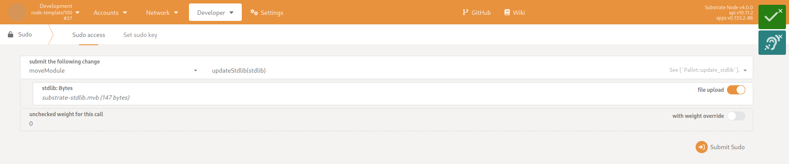

# Move Pallet Tech Guide

In this tech guide, you will find instructions and details on:
- [Quickstart Guide for the Template-Node](#quickstart-guide-for-the-template-node)
- [Testing](#testing)
- [Pallet Configuration in a Substrate-Node](#pallet-configuration-in-a-substrate-node)
- [Benchmarking](#benchmarking)
- [Docker](#docker)
- [Update Standard Libraries](#update-standard-libraries)


## Quickstart Guide for the Template-Node

Compile the template-node and launch locally by:

1. Clone Move pallet and node-template (make sure they are in the same directory):
   ```bash
   git clone https://github.com/eigerco/pallet-move.git
   git clone https://github.com/eigerco/substrate-node-template-move-vm-test --branch pallet-move
   ```

2. Build the node:
   ```bash
   cd substrate-node-template-move-vm-test
   cargo b -r
   ```

3. Run the node in developer mode:
   ```bash
   ./target/release/node-template --dev
   ```

For connecting to the template-node via browser using polkadot.js there are two options:
- Use polkadot.js online with your favorite browser to connect to your local running template-node by opening the URL:
  ```
  https://polkadot.js.org/apps/?rpc=ws%3A%2F%2F127.0.0.1%3A9944#/explorer
  ```
  Therefore, __port 9944 needs to be opened__ by your firewall!

- Alternatively, it can be installed on your computer and be executed locally:
  ```bash
  git clone https://github.com/polkadot-js/apps
  cd apps
  yarn install
  yarn start
  ```
  and open `http://localhost:3000/` in your browser. 
  Then, switch on the left side to the local development chain.
  Now, you can do the same things as with the substrate front-end.


## Testing

Verify that everything works fine by running the pallet's unit tests with all features enabled:
```bash
cargo test --verbose --features build-move-projects-for-test
```

You can also verify that Rust's formatting tool `cargo fmt` was applied by executing:
```bash
cargo fmt --all -- --check
```

Verification for Rust's linter `clippy` by executing:
```bash
cargo clippy --all-targets -- -D warnings
```

_Info: All the above commands are executed in the CI workflow._

If you want to run more MoveVM specific tests, check out [testing strategy in substrate-move](https://github.com/eigerco/substrate-move?tab=readme-ov-file#testing).

Read detailed info about test concepts (what tests cover and how) in the [old testing guide](./milestone-deliverables/m1-testing-guide.md).


## Pallet Configuration in a Substrate-Node

The pallet's configuration is concise. Besides the regular `RuntimeEvent` and a predefined `WeightInfo`, you have to tell the pallet about your `Currency` handler, the used balance data type in your blockchain (`CurrencyBalance`), the maximum lifetime (`MultisigReqExpireTime`) and maximum number of signers (`MaxScriptSigners`) in case of a multi signer script execution request:
```rust
parameter_types! {
    // Number of blocks after that a multi signer request gets removed.
    pub const MultisigReqExpireTime: BlockNumberFor<Test> = 5;
    // Maximum number of signers in a multi signer script execution.
    pub const MaxScriptSigners: u32 = 8;
}

impl pallet_move::Config for Test {
    // The currency handler of this blockchain.
    type Currency = Balances; // here pallet-balances is used
    // The used balance type. For example: `type Balance = u128;`.
    type CurrencyBalance = Balance;
    // Max lifetime of a multi signer execution request, see constant above.
    type MultisigReqExpireTime = MultisigReqExpireTime;
    // Max number of signers in a multi signer execution request.
    type MaxScriptSigners = MaxScriptSigners;
    // Runtime event of this blockchain.
    type RuntimeEvent = RuntimeEvent;
    // Weight info for this pallet.
    type WeightInfo = pallet_move::weights::SubstrateWeight<Test>;
}
```

The pallet provides three extrinsic calls. To find about those check the [design document](final-design.md).

Have a look at the [mockup implementation](https://github.com/eigerco/pallet-move/blob/main/pallet/src/mock.rs) for further coding details, or check the crate's Rust documentation:
```bash
cargo doc --open
```


## Benchmarking

To enable benchmarking, you have to compile the template-node with the feature `runtime-benchmarks` enabled:
```bash
cargo b -r --features runtime-benchmarks
```

Benchmarking and updating weights should be done each time a new extrinsic is added to the pallet (weights are used to estimate transaction fees). 
Weights are obligatory for extrinsics that are available for users.

To update weights, run:
```bash
./target/release/node-template benchmark pallet \
    --chain dev \
    --wasm-execution=compiled \
    --pallet "pallet-move" \
    --extrinsic "*" \
    --steps 50 \
    --repeat 20 \
    --output weights.rs
```
when being in the substrate-based node directory root (template-node). 
The assumption is made that the pallet is located under the `../pallet-move` directory. 
The template for the weights is located under the `./.maintain/frame-weight-template.hbs` directory and can be obtained from the Substrate repository.


## Docker

There is a possibility of generating the docker image containing a working node-template with move-pallet built-in.
To generate an image, run in the __directory of pallet-move__:
```bash
sudo docker build -t "nodemove:Dockerfile" .
```

When the build is ready, you can check if you can see the image in the docker repository by running:
```bash
sudo docker images
```

To run the image, enter:
```bash
sudo docker run nodemove:Dockerfile
```
It will start the `node-template` within a local Docker container. In dependency how you want to use that container, it needs to get adjusted.

> [!TIP]
> To be able to connect via an external polkadot.js instance to the Docker container, the simplest way is to connect the container to your host's network by running:
> ```bash
> docker run --net host nodemove:Dockerfile
> ```
It will start the `node-template` on the local interface. 
You can change the default behavior by passing your command when running the docker image. 
All available options are in the [node template](https://docs.substrate.io/reference/command-line-tools/node-template/) documentation.


## Update Standard Libraries

Two standard libraries are provided for pallet-move at the genesis block creation:
- [`move-stdlib`][move-stdlib] - the normal Move standard library inherited from the Move repo.
- [`substrate-stdlib`][substrate-stdlib] - an extension of the standard library with additional modules - where some of those modules are also substrate-specific modules.

On rare occasions, those libraries can be updated after the genesis block creation by the root account. **WARNING: THIS CAN BREAK THE MOVE-VM ON-CHAIN STORAGE IF IT INTRODUCES BACKWARD INCOMPATIBLE CHANGES - BE CAREFUL WITH THIS OPERATION**

After edits are prepared to the standard library Move packages, compile both bundles using `smove`:
```bash
smove bundle -p move-stdlib
smove bundle -p substrate-stdlib
```
The two generated bundles will be located in the subfolders:
- `build/move-stdlib/bundles/move-stdlib.mvb`
- `build/substrate-stdlib/bundles/substrate-stdlib.mvb`

Use the extrinsic call `update_stdlib_bundle` as the sudo user to update both of them.


For more info about the standard library, check the documentation [here](./stdlib-doc.md).

[move-stdlib]: https://github.com/eigerco/move-stdlib
[substrate-move]: https://github.com/eigerco/substrate-move
[substrate-stdlib]: https://github.com/eigerco/substrate-stdlib
