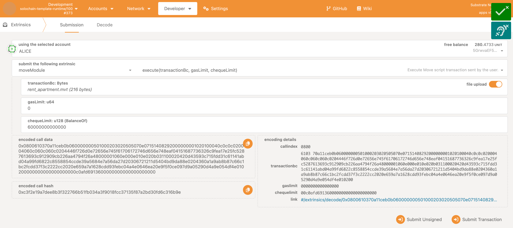

# Multiple Signer Script Execution

### Prerequisites

You have already done the [tutorial](tutorial.md) and you are familiar with publishing modules and executing scripts with the Move pallet.

### Differences to a Single User Script Execution

Again, the story starts with the developer, Bob, who publishes a module.
This time, it is the `Dorm.mv` module from our example move project [`multi-signer`](../pallet/srv/tests/assets/move-projects/multi-signer), which allows to rent apartments for groups of three students each. 
We assumed that dorms with exactly three rooms are available and can only be rented with three students together.
|  |
|:--:|
| _Bob publishes a module using [polkadot.js][polkadotjs]_ |

Again, developer Bob initialises his module by executing the script transaction `init_module.mvt`.
|  |
|:--:|
| _Bob initialises his module using [polkadot.js][polkadotjs]_ |

The student Alice is the first one and executes the script transaction `rent_apartment.mvt`, which is already prepared for the student group Alice, Dave and Eve and with two months of rental.
|  |
|:--:|
| _Alice initiates the multi signer execution request using [polkadot.js][polkadotjs]_ |

Now same script transaction must be executed by Dave and Eve as well.
After all three students have executed that script transaction you should see, that the amounts of tokens have be withdrawn from their accounts.

Because every student has to sign the extrinsic call and execute the script execution, the execution request will be stored in the pallet's storage until every student has signed.
> Note: After the initiation of a multi signer execution requests, the specified cheque limits will be locked until it the request gets executed or deleted.

From the first signer to the one before the last one, they will see the event `SignedMultisigScript`.
After the final signer has signed and executed the same extrinsic call, the script transaction will be executed, tokens with amount of the cheque limit will be unlocked and withdrawn, and the event `ExecuteCalled` will be emitted.
Here, the second was Dave, and the last one was Eve, who signed the extrinsic call. As a result you can see the events in that order.
|  |
|:--:|
| _Events in a multi signer execution requests in [polkadot.js][polkadotjs]_ |

We hope you liked this short introduction about multi-signer script executions. You can find a couple of details more on this more in the [tech guide](tech_guide.md).
