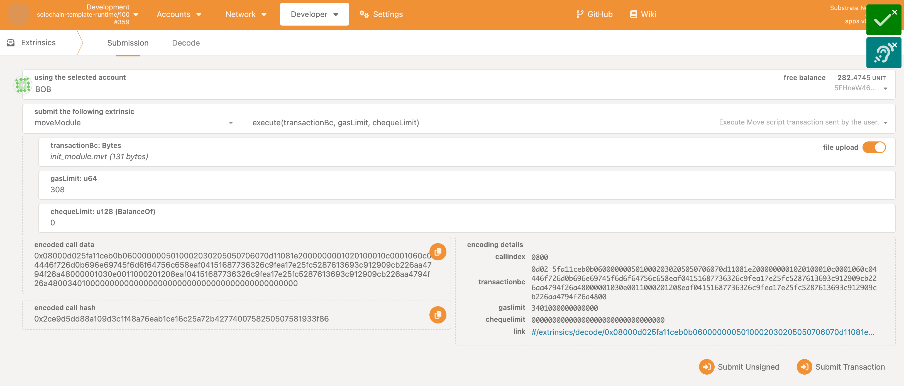

# Multiple Signer Script Execution

### Prerequisites

You have already done the [tutorial](tutorial.md) and you are familiar with publishing modules and executing scripts with the Move pallet.

### Differences to a Single User Script Execution

Again, the story starts with the developer, Bob, who publishes a module.
This time, it is the `Dorm.mv` module from our example move project [`multi-signer`](../pallet/src/assets/move-projects/multiple-signers), which allows to rent apartments for groups of three students each. 
We assumed that dorms with exactly three rooms are available and can only be rented with three students together.

|  |
|:--:|
| _Bob publishes a module using [polkadot.js][polkadotjs]_ |

Again, developer Bob initialises his module by executing the script transaction `init_module.mvt`.
_To create script transactions feel free to use solutions hidden within the `multiple-signers/build.sh` script (or just run the script)._

|  |
|:--:|
| _Bob initialises his module using [polkadot.js][polkadotjs]_ |

Now, let's prepare a script transaction for the script shown below:
```move
fun rent_apartment(acc1: signer, acc2: signer, acc3: signer, months: u8) {
    Dorm::rent_apartment(&acc1, &acc2, &acc3, months);
}
```

The script transaction will group all three users (signers) of the apartment together, so every signer should execute the script
(the order of arguments in the `create-transaction` within the `--args` list, must be the same as in the actual script above):
```sh
move create-transaction --compiled-script-path build/multiple-signers/bytecode_scripts/rent_apartment.mv --args signer:5GrwvaEF5zXb26Fz9rcQpDWS57CtERHpNehXCPcNoHGKutQY signer:5DAAnrj7VHTznn2AWBemMuyBwZWs6FNFjdyVXUeYum3PTXFy  signer:5HGjWAeFDfFCWPsjFQdVV2Msvz2XtMktvgocEZcCj68kUMaw u8:2
```

The student Alice is the first one and executes the created script transaction `rent_apartment.mvt`, which is already prepared for the student group Alice, Dave and Eve and with two months of rental. Alice can set her gas limit to 0 because the script will only be executed after everyone has signed.

Within the `Dorm.move`, we can see that the monthly price is 90 UNITs, so the two-month cost is 180 UNITs.
Every user of the apartment needs to provide a third of the whole cost, which is 60 UNITs (60000000000000 picoUNITs).

|  |
|:--:|
| _Alice initiates the multi signer execution request using [polkadot.js][polkadotjs]_ |

Now, Dave and Eve must execute the same script transaction, and Dave sets his gas limit to 0. Eve estimates the needed gas for the script execution to be 1377 and enters that value because he is the final signer, and the script will be executed now since all signers have provided their signatures.

|  |
|:--:|
| _Eve finalises the multi signer execution request using [polkadot.js][polkadotjs]_ |

After all three students have executed that script transaction you should see, that the amounts of tokens have be withdrawn from their accounts.

Because every student has to sign the extrinsic call and execute the script execution, the execution request will be stored in the pallet's storage until every student has signed.
> Note: After the initiation of a multi signer execution requests, the specified cheque limits will be locked until it the request gets executed, deleted or updated (signing again the same transction script allows user to change the cheque limits in a pending multisig script).

From the first signer to the one before the last one, they will see the event `SignedMultisigScript`.
After the final signer has signed and executed the same extrinsic call, the script transaction will be executed, tokens with amount of the cheque limit will be unlocked and withdrawn, and the event `ExecuteCalled` will be emitted.
Here, the second was Dave, and the last one was Eve, who signed the extrinsic call. As a result you can see the events in that order.
|  |
|:--:|
| _Events in a multi signer execution requests in [polkadot.js][polkadotjs]_ |

We hope you liked this short introduction about multi-signer script executions. You can find a couple of details more on this more in the [the design document](./final-design.md#multi-signer-script-execution).

[polkadotjs]: https://polkadot.js.org/apps/
