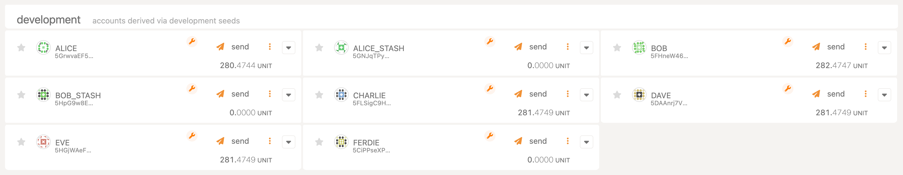

# Move Pallet Tutorial

## Table of Contents

- [Overview](#overview)
- [Setup and Code Example](#setup-and-code-example)
- [Publishing Modules](#publishing-modules)
  - [Estimating Gas for Module Publication](#estimating-gas-for-module-publication)
  - [Publication](#publication)
- [Executing Scripts](#executing-scripts)
  - [Creating Script Transactions](#creating-script-transactions)
  - [Estimating Gas for Script Execution](#estimating-gas-for-script-execution)
  - [Execution](#execution)
- [Finishing the Tutorial](#finishing-the-tutorial)


## Overview

In this tutorial, we are going to show you how to access the MoveVM hosted inside the `pallet-move`, integrated inside the [template node][template-node-repo].

To make Move interoperable with Substrate, we provide the package manager [smove](https://github.com/eigerco/smove), which can compile your Move projects, create bundles, access and act with the network node and more.

This tutorial shows a summary of a workflow with Move on a Substrate template node. We will publish a module and execute a script which uses that module's functionality.
Therefore, the package manager `smove` will be used to compile those resources, estimate the required amount of gas, and create the `script-transaction`.
Finally, we publish the module and execute a script via using [polkadot.js][polkadotjs]).

### Actors in this tutorial

- Bob (with address: `5FHneW46xGXgs5mUiveU4sbTyGBzmstUspZC92UhjJM694ty`)
  - who will publish the module and enable the module so other users can use it.

- Alice (with address `5GrwvaEF5zXb26Fz9rcQpDWS57CtERHpNehXCPcNoHGKutQY`)
  - who will use Bob's module to register her account in his smart contract and then use the module's functionality (buying and spending a token).


## Setup and Code Example

Prerequisites:
- [Install smove](https://github.com/eigerco/smove).
- Setup our template node with pallet-move integrated and run it in the background - the instructions can be found in our [tech guide](./tech_guide.md).
  - Either use [polkadot.js][polkadotjs] or run a local frontend for the node running in the background.
- Switch the current working directory to the code example directory in `pallet-move/tests/assets/move-projects/car-wash-example`.

In our example, a simple car wash is modelized, where washing coins are used to control the usage of the car wash.
Users can register, buy washing coins and use them to start the car wash.
For the sake of simplicity, we show here only the function headers of the Move module, the full module can be seen [here](https://github.com/eigerco/pallet-move/blob/main/tests/assets/move-projects/car-wash-example/sources/CarWash.move).

```move
module DeveloperBob::CarWash {
    /// Simple solution, fixed price for one washing coin.
    const COIN_PRICE: u128 = 1000000000000; // equals 1 UNIT

    /// Struct stores number of coins for each user.
    struct Balance has key, store {
        coins: u8
    }

    /// Method executes the ICO without money. The module owner (also the car wash owner) gets deposited the minted washing coins.
    public fun initial_coin_minting(module_owner: &signer) {}

    /// Registers a new user. The account address will be added to the storage Balance with zero initial washing coins.
    public fun register_new_user(account: &signer) {}

    /// Buys `count` washing coin(s) for the car wash. Therfore, `COIN_PRICE` * `count` will be withdrawn from the user's account.
    public fun buy_coin(user: &signer, count: u8) acquires Balance {}

    /// Initiates the washing process by paying one washing coin.
    public fun wash_car(user: &signer) acquires Balance {}
}
```

All public module methods can be used in an executable script, for example:
```move
script {
    use DeveloperBob::CarWash;
    
    fun initial_coin_minting(account: signer) {
        CarWash::initial_coin_minting(&account);
    }
}
```

Now, let's compile this project to be ready for the estimation of needed gas and publication of the module.
```sh
smove build
```

## Publishing Modules

### Estimating Gas for Module Publication

Gas can be seen as weights in the Substrate. It will adjust the fees for the execution or publication of Move resources. Hereby, we prevent malicious scripts from running forever.

To estimate the optimal amount of gas for your module, use `smove` tool:
```sh
smove node rpc estimate-gas-publish-module --account-id 5FHneW46xGXgs5mUiveU4sbTyGBzmstUspZC92UhjJM694ty --module-path build/car-wash-example/bytecode_modules/CarWash.mv
```

The successful result will look like:
```sh
Estimated gas: Estimate (gas_used: 74, vm_status_code: EXECUTED)
```

### Publication

The compiled bytecode file can be found in the subfolder
```sh
build/car-wash-example/bytecode_modules
```

Do the following steps in [polkadot.js][polkadotjs] GUI:
* Switch to menu _Developer_->_Extrinsics_.
* Select the Move pallet. Our template node is called `moveModule`.
* For this pallet, choose extrinsic `publishModule(bytecode, gasLimit)` and select `Bob` as the user who shall submit the transaction.

Parameter explanation:
  - __bytecode__ represents the compiled module bytecode. Fill it up by uploading the compiled file `CarWash.mv` (from the previous compilation).
  - __gasLimit__ - use the estimated optimal amount of gas for publishing this module from the previous subsection. Using less than that will make the extrinsic fail, while using more is unnecessary (and more costly).

|  |
|:--:|
| _Publish a module using [polkadot.js][polkadotjs]_ |

Note that the module can only be published if the specified module address `DeveloperBob` in the `Move.toml` file of the Move project matches the user's address (in this case, Bob's wallet address).

Additionally, we can verify that the module has successfully been published by requesting the module's ABI specification using `smove`:
```sh
smove node rpc get-module-abi --address 5FHneW46xGXgs5mUiveU4sbTyGBzmstUspZC92UhjJM694ty --name CarWash
```
You should get a longer response that starts with:
```sh
Module ABI: Some(ModuleAbi { # ...
```
That is the proof that the module has been published on the chain successfully.


## Executing Scripts

### Creating Script Transactions

Compiled move scripts must be passed to pallet-move's extrinsic calls in serialized transactions, which are created with the `create-transaction` command. If scripts require additional function parameters, those input parameters also have to be provided to our command:
```sh
smove create-transaction --compiled-script-path build/car-wash-example/bytecode_scripts/initial_coin_minting.mv --args signer:5FHneW46xGXgs5mUiveU4sbTyGBzmstUspZC92UhjJM694ty
```
_An important note here - if the script function requires a signer, that signer's address needs to be the same as the Substrate account which will use this serialized transaction to execute this script._
_In the above case, we used Bob's address since he owns the module and wants to enable the module by executing the `initial_coin_minting` script._

If you see the following message:
```sh
Script transaction is created at: # ...
```
It means the script and provided parameters have been serialized into the specified output file (serialized transaction), which can now be used in [polkadot.js][polkadotjs]:

### Estimating Gas for Script Execution

Now - like when publishing a module - the optimal amount of needed gas for the script execution can also be estimated by using `smove`:
```sh
smove node rpc estimate-gas-execute-script -a 5FHneW46xGXgs5mUiveU4sbTyGBzmstUspZC92UhjJM694ty -s build/car-wash-example/script_transactions/initial_coin_minting.mvt --cheque-limit 0
```
with response:
```sh
Estimated gas: Estimate (gas_used: 21, vm_status_code: EXECUTED)
```

### Execution

To execute a Move script in pallet's MoveVM, use the `execute(transactionBc, gasLimit, chequeLimit)` extrinsic with the following parameters:

|  |
|:--:|
| _Execute a script with parameters in polkadot.js_ |

Parameters are:
* __transactionBc__ represents the serialized script transaction generated by the `smove create-transaction` command. Fill it up by uploading the generated file `initial_coin_minting.mvt`. This encoded file contains the actual Move script bytecode and the script parameter list (since the same Move script can use different input parameters).
* __gasLimit__ is a limitation for the maximum gas the script is allowed to use in the MoveVM. If the script requires more gas than provided, MoveVM will fail to execute the script, and the user will need to retry again with more gas provided.
* __chequeLimit__ is your balance limit for the optional funds transfer between accounts. If set to zero, no funds can be withdrawn during the script execution. In this example, the script `initial_coin_minting` will not try to charge any funds, but `buy_coin` from the next chapter will (and it shall fail if the user hasn't written the cheque when signing the extrinsic).

## Finishing the Tutorial

You have successfully published a Move module on your Polkadot blockchain and executed a Move script successfully.

|  |
|:--:|
| _Observe the balance before we execute some new scripts which will charge the user_ |

Now, let's execute the following actions:
1. Using Alice's account, let's register her as a customer by executing the `register_new_user.mv` script
  - _Hint 1: This script requires one signer, who has to be Alice's account ID._
  - _Hint 2: Use the estimation RPC method to calculate gas._
  - _Hint 3: `cheque_amount` is unused in this script, so set it to zero (it's always safer not to allow scripts to charge you anything if not necessary)._
    <details>
    <summary>Click here to unlock the hidden command for the above action.</summary>
  
    ```
    # First, let's create a transcation script:
    smove create-transaction --compiled-script-path build/car-wash-example/bytecode_scripts/register_new_user.mv --args signer:5GrwvaEF5zXb26Fz9rcQpDWS57CtERHpNehXCPcNoHGKutQY

    # Now let's estimate gas for this transaction-script:
    smove node rpc estimate-gas-execute-script -a 5GrwvaEF5zXb26Fz9rcQpDWS57CtERHpNehXCPcNoHGKutQY -s build/car-wash-example/script_transactions/register_new_user.mvt --cheque-limit 0
    ```
    </details>
    
    ------------------------------------------------------------------------------------------------------------------------------------------------------------
2. Now, again using Alice's account, buy a single coin with a `buy_coin.mv` script:
  - _Hint: Because the price of a washing coin is `1 UNIT`, we need to write a cheque with a value of at least `1000000000000`._
    <details>
    <summary>Click here to unlock the hidden command for the above action.</summary>
  
    ```
    # The script will try to transfer the amount of funds required to buy a specified (via the script arguments in the create-transaction command) number
    # of wash coins - so the `cheque_limit` needs to have an appropriate value so that the script won't fail while trying to charge the user.
    #
    # Notice the `u8:1` script argument - it indicates the number of wash coins, and we are buying here just one.
    smove create-transaction --compiled-script-path build/car-wash-example/bytecode_scripts/buy_coin.mv --args signer:5GrwvaEF5zXb26Fz9rcQpDWS57CtERHpNehXCPcNoHGKutQY u8:1

    # Now let's estimate gas for this transaction-script.
    # `cheque_limit` also needs to be specified here, the RPC command will just if the use has enough funds, if not, it will report an error:
    smove node rpc estimate-gas-execute-script -a 5GrwvaEF5zXb26Fz9rcQpDWS57CtERHpNehXCPcNoHGKutQY -s build/car-wash-example/script_transactions/buy_coin.mvt --cheque-limit 1000000000000
    ```
    
    |  |
    |:--:|
    | _Script execution with the adjusted __chequeLimit___ |
    </details>

    ------------------------------------------------------------------------------------------------------------------------------------------------------------
3. _(Optional)_ Wash the car with Alice's account.
    <details>
    <summary>Click here to unlock the hidden command for the above action.</summary>
  
    ```
    # The check_limit isn't required here (so it should be set to zero for safety reasons) since Alice will burn the MoveVM spend token in order to wash her car.
    smove create-transaction --compiled-script-path build/car-wash-example/bytecode_scripts/wash_car.mv --args signer:5GrwvaEF5zXb26Fz9rcQpDWS57CtERHpNehXCPcNoHGKutQY

    # Now let's estimate gas for this transaction-script:
    smove node rpc estimate-gas-execute-script -a 5GrwvaEF5zXb26Fz9rcQpDWS57CtERHpNehXCPcNoHGKutQY -s build/car-wash-example/script_transactions/wash_car.mvt --cheque-limit 0
    ```
    </details>

|  |
|:--:|
| _After buying a washing coin, check how the above operations have affected **Alice's balance**_ |

------------------------------------------------------------------------------------------------------------------------------------------------------------
We hope you finished our tutorial without any issues! And we hope you liked it. To see the full API for this pallet, check our design [document](final-design.md) here.

To learn about the differences in executing a script with multiple signers, have a look at this additional [tutorial](tutorial-multi-signer.md).

If you want to report feedback, please feel free to do so. We are always available at [hello@eiger.co](mailto:hello@eiger.co).

[polkadotjs]: https://polkadot.js.org/apps/
[template-node-repo]: https://github.com/eigerco/substrate-node-template-move-vm-test
