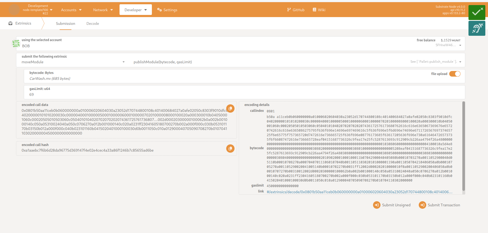
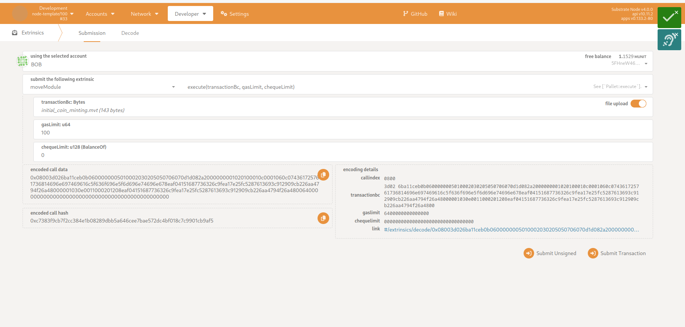
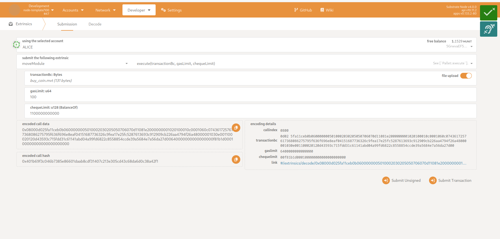

# Move Pallet Tutorial

## Table of Contents

- [Overview](#overview)
- [Setup and Code Example](#setup-and-code-example)
- [Gas Estimation for Publishing a Module](#gas-estimation-for-publishing-a-module)
- [Publishing Modules](#publishing-modules)
- [Executing Scripts](#executing-scripts)


## Overview

To make Move interoperable with Substrate, we provide the package manager [smove](https://github.com/eigerco/smove), which can compile your Move projects, create bundles, access and act with the network node and more.

This tutorial shows a summary of a workflow with Move on a Substrate template node. We will publish a module and execute a script which uses that module's functionality. Therefore, the package manager `smove` will be used to compile those resources, estimate the required amount of gas, and to create the `script-transaction`. Finally, we publish the module and execute a script via using [polkadot.js](https://polkadot.js.org/apps/).


## Setup and Code Example 

Initial requirements:
- [Install smove](https://github.com/eigerco/smove).
- Setup our [our template node](https://github.com/eigerco/substrate-node-template-move-vm-test) with pallet-move integrated and run it in the background.
- Switch the current working directory to the code example directory in `pallet-move/tests/assets/move-projects/car-wash-example`.

In our example, a simple car wash is modelized, where washing coins are used to control the usage of the car wash. Users can register, buy washing coins and use them to start the car wash. For the sake of simplicity, we show here only the function headers of the Move module, the full module can be seen [here](https://github.com/eigerco/pallet-move/blob/main/tests/assets/move-projects/car-wash-example/sources/CarWash.move).

```move
module DeveloperBob::CarWash {
    /// Struct stores number of coins for each user.
    struct Balance has key, store {
        coins: u8
    }

    /// Method executes the ICO without money. The module owner (also the car wash owner) gets deposited the minted washing coins.
    public fun initial_coin_minting(module_owner: &signer) {}

    /// Registers a new user. The account address will be added to the storage Balance with zero initial washing coins.
    public fun register_new_user(account: &signer) {}

    /// Buys a washing coin for the car wash. Therfore, `COIN_PRICE` will be withdrawn from the user's account.
    // Note: It would be nice to have the ability to buy multiple coins at once, but it's not implemented for this example.
    public fun buy_coin(user: &signer) acquires Balance {}

    /// Initiates the washing process by paying one washing coin.
    public fun wash_car(user: &signer) acquires Balance {}
}
```

All public module methods can be used in an executable script, for example:
```move
script {
    use DeveloperBob::CarWash;
    
    fun initial_coin_minting(account: signer) {
        CarWash::initial_coin_minting(&account);
    }
}
```

Now, let's compile this project to be ready for the estimation of needed gas and publication of the module.
```sh
smove build
```

## Gas Estimation for Publishing a Module

Gas can be seen as weights in the Substrate. It will adjust the fees for the execution or publication of Move resources. Hereby, we prevent malicious scripts from running forever.

To estimate the optimal amount of gas for your module, use `smove` tool:
```sh
smove node rpc estimate-gas-publish-module --account-id 5FHneW46xGXgs5mUiveU4sbTyGBzmstUspZC92UhjJM694ty --module-path build/car-wash-example/bytecode_modules/CarWash.mv
```

The successful result will look like:
```sh
Estimated gas: Estimate (gas_used: 69, vm_status_code: EXECUTED)
```

## Publishing Modules

The compiled bytecode file can be found in the subfolder
```sh
build/car-wash-example/bytecode_modules
```

Do the following steps in polkadot.js GUI:
* Switch to menu _Developer_->_Extrinsics_.
* Select the Move pallet. In our template node it is called `moveModule`.
* For this pallet, choose extrinsic `publishModule(bytecode, gasLimit)`. Parameter explanation:
* - __bytecode__ represents the compiled module bytecode. Fill it up by uploading the compiled file `CarWash.mv` (from the previous compilation).
* - __gasLimit__ - use the estimated optimal amount of gas for publishing this module from the previous subsection. Using less than that will make the extrinsic fail, while using more is unnecessary (and more costly).



Note that the module can only be published if the specified module address `DeveloperBob` in the `Move.toml` file of the Move project matches the user's address (in this case, Bob's wallet address).

Additionally, we can verify that the module has successfully been published by requesting the module's ABI specification using `smove`:
```sh
smove node rpc get-module-abi --address 5FHneW46xGXgs5mUiveU4sbTyGBzmstUspZC92UhjJM694ty --name CarWash
```
You should get a longer response that starts with:
```sh
Module ABI: Some(ModuleAbi { # ...
```
That is the proof that the module has been published on the chain successfully.


## Executing Scripts

Compiled move scripts must be passed to pallet-move's extrinsic calls in serialized transactions, which are created with the `create-transaction` command. If scripts require additional function parameters, those input parameters also have to be provided to our command:
```sh
smove create-transaction --compiled-script-path build/car-wash-example/bytecode_scripts/initial_coin_minting.mv --args signer:5FHneW46xGXgs5mUiveU4sbTyGBzmstUspZC92UhjJM694ty
```
_An important note here - if the script function requires a signer, that signer's address needs to be the same as the Substrate account which will use this serialized transaction to execute this script._

If you see the following message: 
```sh
Script transaction is created at:
# ... 
```
It means the script and provided parameters have been serialized into the specified output file (serialized transaction), which can now be used in polkadot.js:

Now - like when publishing a module - the optimal amount of needed gas for the script execution can also be estimated by using `smove`:
```sh
smove node rpc estimate-gas-execute-script -a 5FHneW46xGXgs5mUiveU4sbTyGBzmstUspZC92UhjJM694ty -s build/car-wash-example/script_transactions/initial_coin_minting.mvt --cheque-limit 0
# Estimated gas: Estimate (gas_used: 21, vm_status_code: EXECUTED)
```



The additional parameters are:
* __gasLimit__ is a limitation for the maximum gas the script is allowed to use in the MoveVM. If the script requires more gas than provided, MoveVM will fail to execute the script, and the user will need to retry again with more gas provided.
* __chequeLimit__ is your token limit for optional transfer of tokens between accounts. If the parameter is set to zero, no tokens can be withdrawn during the script execution. In this example the script `initial_coin_minting` will not withdraw any tokens, but `buy_coin` will need to.



The flow of this code example is:
* Bob: `initial_coin_minting`, but only once after publication.
* Alice: `register_new_user`, but only once after publication.
* Alice: `buy_coin`.
* Alice: `wash_car` for each time you bought a washing coin.

You have now successfully published a Move module on your Polkadot blockchain and executed successfully Move scripts.

We hope you managed to finish our tutorial without any issues! And we hope you liked it. If you want to report feedback, please feel free to do so.
We are always available at: [hello@eiger.co](mailto:hello@eiger.co).
