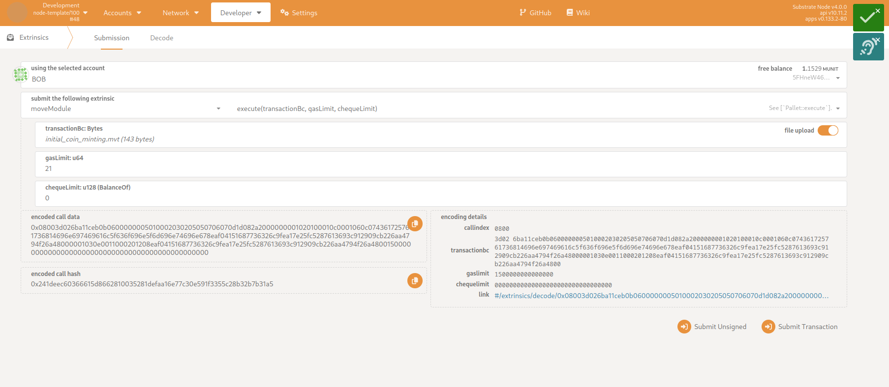

# Move Pallet Tutorial

## Table of Contents

- [Overview](#overview)
- [The Code Example](#the-code-example)
- [Publishing Modules](#publishing-modules)
- [Estimation of Needed Gas](#estimation-of-needed-gas)
- [Executing Scripts](#executing-scripts)

## Overview

To make Move interoperable with Substrate, we provide the package manager [smove](https://github.com/eigerco/smove), which can compile your Move projects, create bundles, access and act with the network node and more.

In this tutorial we are showing a summary of a workflow with Move on a Substrate template node. We will publish a module and execute a script which uses that module's functionality. Therefore, the package manager `smove` will be used to compile those resources, to estimate the needed amount of gas, and to create the script-transaction. Finally we publish the module and execute a script via using [polkadot.js](https://polkadot.js.org/apps/).

## The Code Example 

In our example, a simple car wash is modelized, where washing coins are used to control the usage of the car wash. Users can register, buy washing coins and use them to start the car wash. For the sake of simplicity, we show here only the function headers of the Move module, the full module can be seen [here](https://github.com/eigerco/pallet-move/blob/main/tests/assets/move-projects/car-wash-example/sources/CarWash.move).

```move
module DeveloperBob::CarWash {
    /// Struct stores number of coins for each user.
    struct Balance has key, store {
        coins: u8
    }

    /// Method executes the ICO without money. The module owner (also the car wash owner) gets deposited the minted washing coins.
    public fun initial_coin_minting(module_owner: &signer) {}

    /// Registers a new user. The account address will be added to the storage Balance with zero initial washing coins.
    public fun register_new_user(account: &signer) {}

    /// Buys a washing coin for the car wash. Therfore, `COIN_PRICE` will be withdrawn from the user's account.
    // Note: It would be nice to have the ability to buy multiple coins at once, but it's not implemented for this example.
    public fun buy_coin(user: &signer) acquires Balance {}

    /// Initiates the washing process by paying one washing coin.
    public fun wash_car(user: &signer) acquires Balance {}
}
```

Each publically usable method will be depicted into an executable script, like this style:
```move
script {
    use DeveloperBob::CarWash;
    
    fun initial_coin_minting(account: signer) {
        CarWash::initial_coin_minting(&account);
    }
}
```

## Publishing Modules

Now we compile the project by using `smove`:
```sh
smove build
```

The compiled bytecode file can be found in the subfolder `build/car-wash-example/bytecode_modules`. In this tutorial we running a Substrate template node with pallet-move already integrated. Description how tu run that can be found [here](https://github.com/eigerco/substrate-node-template-move-vm-test). In polkadot.js via __Developer__->__Extrinsics__ we can select the `moveModule` and extrinsic `publishModule(bytecode, gasLimit)`. Paramter __bytecode__ will be filled by uploading the compiled file `CarWash.mv`. To limit possible fees for the publication, we can adjust the __gasLimit__ or set the value high enough to just accept it. How the needed amount of gas can be estimated properly, will be shown in the [next subsection](#estimation-of-needed-gas).


Note, that the module can only be published, if the specified module address `DeveloperBob` matches the users address (which is in this case Bob's wallet address).

## Estimation of Needed Gas

Gas can be seen as weights in Substrate. It will adjust the fees for the execution or publication of Move resources. Hereby we prevent that scripts will be sued to exploit somehow the blockchain.

A good estimation of needed amount of gas for publishing a module can be provided by `smove`:
```sh
smove node rpc estimate-gas-publish-module --account-id 5FHneW46xGXgs5mUiveU4sbTyGBzmstUspZC92UhjJM694ty --module-path build/car-wash-example/bytecode_modules/CarWash.mv
```

The successful result will look like:
```sh
Estimated gas: Estimate (gas_used: 68, vm_status_code: EXECUTED)
```

## Executing Scripts

Compiled move resources will be passed to pallet-move's extrinsic calls in form of bytecode. polkadot.js automatically serializes uploaded files, but if scripts require additional function parameters, they also have to be serialized on top of the script bytecode. To accomplish that we use also `smove`:
```sh
smove create-transaction --compiled-script-path build/car-wash-example/bytecode_scripts/initial_coin_minting.mv --args signer:5FHneW46xGXgs5mUiveU4sbTyGBzmstUspZC92UhjJM694ty
```

If you see the following message, script and passed parameters have been serialized into the specified output file, which now can be pu into polkadot.js:


With the additional parameters __gasLimit__ and __chequeLimit__ a limitation for maximum gas usage for the script execution can be specified, and further a token limit for optional transfer of tokens between accounts. If the __chequeLimit__ will be set to zero, no tokens can be withdrawn during the script execution. In this example the script `initial_coin_minting` will not withdraw any tokens, but `buy_coin` will need to.


